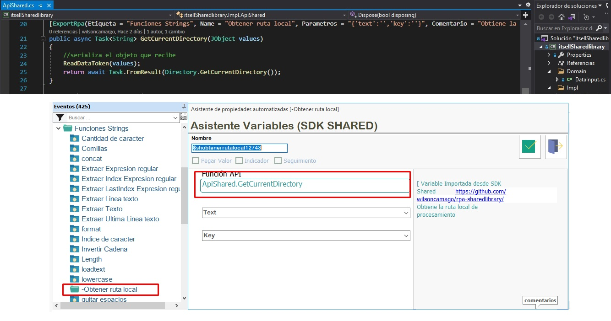

 

# Smart Bot Suite 

Software que usa las funcionalidades nativas de las aplicaciones o sistemas para poder configurar robots y automatizaciones que ejecutan actividades de forma automática.

 

### Instalación Bot ###

* [Ver mas](docs/general/Instalacion.md)
* Descargue el complemento [aquí](https://rpamodel.s3.amazonaws.com/UpdaterRpa.zip) 

### Instalación SDK ###

La solucion "itsellSharedlibrary.sln" tiene un conjunto de librerias para extender la funcionalidad del software [Ver mas](docs/index.md), son complementos que permiten a los desarrolladores crear sus propias funciones e instalarlas en el tablero de automatizacion.

* Clonar repositorio
* Dependencias packages - Newtonsoft.Json.12.0.3
* Compilar Visual Studio 2019
* Copiar la libreria Liper.Publicador.Sharedlibrary.dll en la carpeta root del RPA
* No remplazar libreria Liper.Publicador.Common.dll

### Documentación ###

* [Ver mas](docs/index.md)

### Funciones ###

| Característica            | Referencia |
| --------------------------------- | ----------- |
|Archivos |[Archivos](docs/funciones/Archivos.md)|
|base de datos |[Base de Datos](docs/funciones/BasedeDatos.md)|
|Compresion |[Comprimir](docs/funciones/Comprimir.md)|
|Condicionales |[Condiciones](docs/funciones/Condiciones.md)|
|Consola |[Consola](docs/funciones/Consola.md)|
|Desencadenadores|[Desencadenadores](docs/funciones/Desencadenadores.md)|
|Eventos |[Eventos Robot](docs/funciones/EventosRobot.md)|
|Excel |[Excel](docs/funciones/Excel.md)|
|Ftp|[Ftp](docs/funciones/Ftp.md)|
|Funciones fechas|[Funciones Fechas](docs/funciones/FuncionesFechas.md)|
|Matemáticas |[Funciones Matematicas](docs/funciones/FuncionesMatematicas.md)|
|Cadenas de texto|[Funciones Strings](docs/funciones/FuncionesStrings.md)|
|Json|[JSON](docs/funciones/JSON.md)|
|Loops|[Loop](docs/funciones/Loop.md)|
|Correo|[Mail](docs/funciones/Mail.md)|
|Mouse|[Mouse](docs/funciones/Mouse.md)|
|Ocr|[OCR](docs/funciones/OCR.md)|
|Pdf|[PDF](docs/funciones/PDF.md)|
|Seguridad|[Seguridad](docs/funciones/Seguridad.md)|
|Tablas|[Tablas](docs/funciones/Tablas.md)|
|Teclado|[Teclado](docs/funciones/Teclado.md)|
|Temporizador|[Temporizador](docs/funciones/Temporizador.md)|
|Web|[Web](docs/funciones/Web.md)|
|Whatsapp|[Whatsapp](docs/funciones/Whatsapp.md)|
|Windows|[Windows](docs/funciones/Windows.md)|

### Beneficios ###

### Instalación Dashboard ###

Disponibilidad de monitoreo de agentes de automatización el tablero de mando

* [Ver mas](docs/general/Instalacion.md)

* Descargue el Agente [aquí](https://rpamodel.s3.amazonaws.com/ServiceAgent.zip) 

* Descargue el Dashboard [aquí](https://rpamodel.s3.amazonaws.com/Dashboard.zip) 

  

### Licencia ###

Este código y el uso del SDK y extensibilidad de las funciones de automatización quedan bajo su propio riesgo y responsabilidad, bajo las leyes gubernamentales del territorio donde sea implementado.

Todos los derechos  reservados. Ninguna parte de  esta obra puede ser   reproducida en   cualquier forma o por cualquier   medio  -  gráfico,   electrónico   o mecánico, incluyendo fotocopia, grabación, grabación o sistemas de almacenamiento y recuperación de información y sin el permiso escrito del editor.
