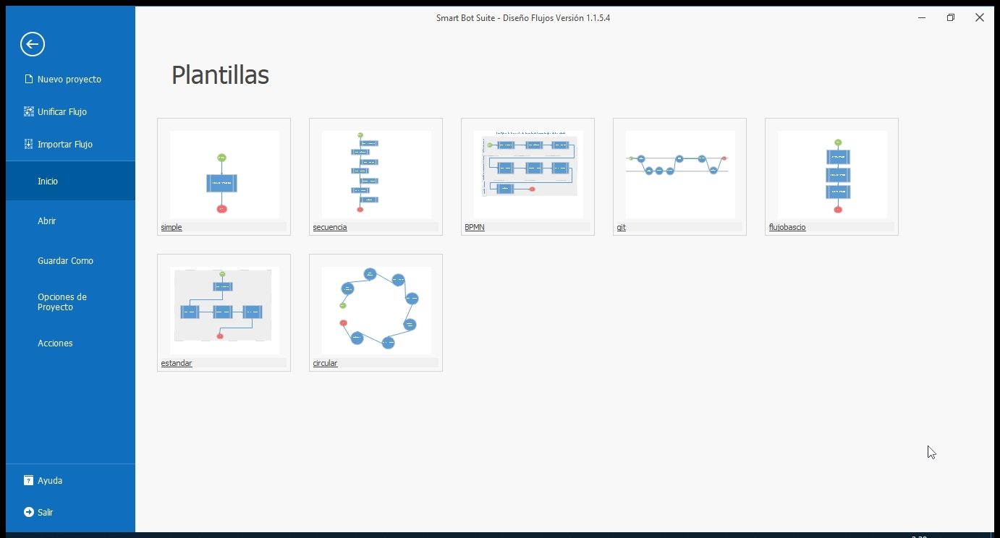
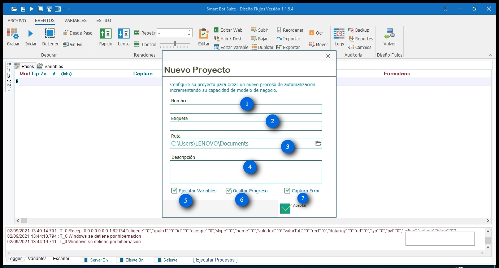
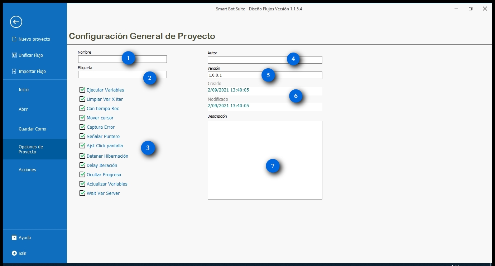
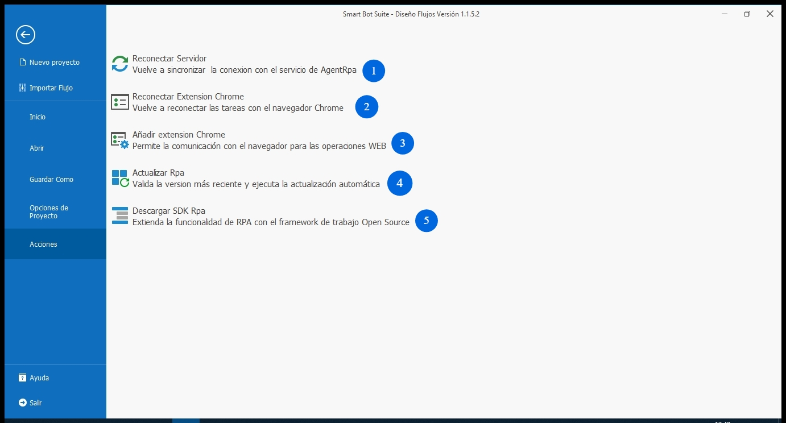

# Archivo

### El menú de archivo de SmartBotCaptura se puede mostrar haciendo clic en el botón "Archivo" en la parte superior izquierda de la ventana principal.

## Inicio

Smart Bot captura tiene incorpora plantillas de arboles de procesos que agilizaran los modelos de procesos de negocio para automatizar.

## **Nuevo Proyecto:** permite crear un nuevo proyecto.

1. **Nombre:** Asigne un nombre al proyecto que desea automatizar.
2. Etiqueta: Asigne una etiqueta similar al nombre del proyecto para identificar fácilmente si es el caso se presenten más procesos para automatizar del mismo proyecto.
3. Ruta: Indique la ruta donde se almacenará el archivo del proceso previamente configurado y automatizado.
4. Descripción: Agregue una breve descripción acerca de que flujo o proceso que se desea automatizar.
5. Ejecutar Variables: Al activar esta función permitirá que al iniciar la iteración de un proceso previamente automatizado se ejecuten los parámetros y valores que contengan las varibles.
6. Ocultar Progreso: Al activar esta función permitirá ocultar la imagen del paso a paso de lo que sucede al ejecutar el proceso automatizado.
7. Capturar Error: Al activar esta función le permitirá al robot tomar una captura de pantalla en el momento en el que algún evento clic o de teclado presente error.

---

- **Importar Flujo:** permite cargar una plantilla de una secuencia de pasos antes creada en la ventana de eventos.
- **Inicio:** permite mostrar los flujos de trabajo recién configurados.
- **Abrir:** permite abrir una plantilla de proyecto previamente configurada y guardada.
- **Guardar Como:** permite guardar un nuevo proyecto de automatización que se esté configurando.

## **Opciones de proyecto:**

1. **Nombre:** Permitirá editar el nombre del flujo.
2. **Etiqueta:** permite modificar la etiqueta de determinado flujo que se asocie a un mismo proyecto.
3. **Configuración general de proyecto:**
- Ejecutar Variables: permite ejecutar **TODAS** las variables creadas en el flujo de automatización.
- Limpiar Var x Iteración: permite borrar los valores que contenían las variables de la iteración anterior para almacenar nuevos valores de la siguiente iteración.
- Con tiempo de grabado: permite tomar el tiempo que se demora cada paso al ejecutarse o que el usuario le asigne.
- Mover cursor: permite mostrar el efecto de movimiento del cursor que previamente se halla grabado.
- Captura Error: permite identificar por medio de una captura de pantalla de un evento que no pudo ejecutar.
- Señalar puntero: permite identificar por medio de una señal en determinado evento en que lugar realizó clic el puntero.
- Ajustar click pantalla: permite ajustar las coordenadas de los eventos para ejecutar clic dependiendo de las dimensiones de la pantalla y el botón o la opción esté en el mismo lugar.
- Detener Hibernación: permite detener el robot cuando la aplicación de escritorio entra en estado de hibernación.
- Delay Iteración: permite dar un segundo de espera para empezar una nuevo iteración.
- Actualizar Variables: permite actualizar el valor calculado de las variables que se ejecutaron durante la ejecución para verificar si se está calculando correctamente o no.
- Esperar variable de servidor: permite que de un robot a otro o a otros se les asigne ciertas variables para ejecutar.
1. **Autor:** permite asignarle el nombre de quien realizo la parametrización del flujo.
2. **Versión:** Permite agregar versiones al flujo que se le realicen cambios o mejoras.
3. **Creado/modificado:** Permite realizar seguimiento de la fecha de creación y última fecha en que fue modificado el flujo.
4. **Descripción:** permite editar la breve descripción de que trata el flujo.

## **Acciones:**

1. **Reconectar Servidor:** permite volver a sincronizar la conexión con el servicio de AgentRpa.
2. **Reconectar Extensión Chrome:** permite volver a reconectar la tareas con el navegador Chrome.
3. **Añadir extensión Chrome:** permite la comunicación con el navegador para las operaciones WEB.
4. **Actualizar Rpa**: permite validar la versión más reciente y ejecuta la actualización automática.
5. **Descargar SDK Rpa:** permite extender la funcionalidad de RPA con el framework de trabajo Open Source.
- **Ayuda**: permite mostrar información sobre derechos reservados del software.
- **Salir:** permite salir de entorno de trabajo del software.