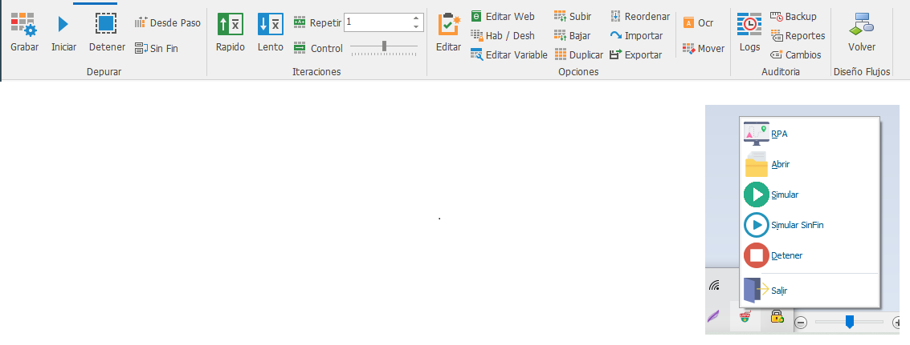

# Eventos

1. **Editar:** permite configurar un evento desde la ventana de Propiedades.
2. **Eliminar:** permite eliminar un evento de una secuencia.
3. **Duplicar:** permite duplicar un evento de una secuencia.
4. **Habilitar/ deshabilitar:** permite habilitar o deshabilitar un evento de una secuencia.
5. **Ejecutar:** permite ejecutar una plantilla de una secuencia de eventos previamente cargada.
6. **Editar Variable:** Edita una variable a determinado evento.
7. **Insertar variable:** Insertar una variable a determinando evento
8. **Exportar:** Exportar una plantilla de secuencia de eventos previamente automatizada.
9. **Importar:** Importa una plantilla de secuencia de eventos previamente automatizada.
10. **Reordenar:** Permite organizar de manera consecutiva cada evento de una flujo automatizado.
11. **Recapturar:** Permite recapturar nuevamente los eventos de una secuencia. 12.Subir: Permite subir un paso de la secuencia.
12. **Bajar:** Permite bajar un paso de la secuencia.
13. **Mas tiempo:** Permite agregar más tiempo de ejecución de determinado paso.
14. **Menos tiempo:** Permite disminuir el tiempo de ejecución de determinado paso. 16.Opciones rápidas de herramientas para crear un evento.
15. **OCR**: variables que permiten extraer, reconocer y ubicar bloques de texto de una imagen.
16. **Acceso rápido:** fácil acceso para agregar variables programadas de la sección de herramientas a determinados eventos.

[Variables](Eventos/Variables.md)

[Editar Evento](Eventos/Editar-Evento.md)

