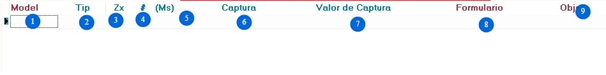

# Editar Evento

## Editar Tabla Eventos

Descripción de los campos donde se almacenan los eventos o secuencia de pasos para su correcta configuración:

- **Modelo:** asigna el tipo de variable que se almacena en el evento.
- **Tipo:** si es un evento en escritorio o web.
- **Zx:**
- **número (#):** enumeración consecutiva de los pasos.
- **(Ms):** el tiempo en milisegundos que demora cada paso cuando se realiza la grabación y es posible modificar el tiempo en el mismo paso
- **Captura:** Muestra la descripción de la pantalla donde se realizó el clic o entrada de teclado.
- **Valor de Captura:** asigna una variable que puede almacenar un valor determinado.

# Editar Evento visor

ACCIONES PREVIAS

- Maximizar Ventana: Al marcar la casilla máximiza una ventana en escritorio o navegador web antes de ejecutar el parámetro contenido en una variable.
- Restaura coordenadas: Al marcar la casilla permite volver a los valores iniciales de coordenadas de captura antes de ejecutar el parámetro contenido en una variable.
- Valida estado cursor: Al marcar la casilla permite validar si el cursor se encuentra visible o no en el reporte Log.
- Selecciona todo texto: al marcar la casilla permite

ACCIONES POSTERIORES

- Verifica cambio de ventana: Al marcar la casilla permite verificar si hubo cambio de cualquier tipo de ventana.
- Verifica cambio de cursor: Al marcar la casilla permite

VENTANAS

- 
- Tipo de evento SO: al marcar esta casilla permite validar si es de tipo
- Set value: Al marcar la casilla se valida que el evento envía un valor para seguir el flujo normal del proceso de automatización.

COORDENADAS

Permite ubicar a través de una medida de coordenada la ubicación donde se realizó clic en un evento.

VARIABLES

Permite agregar el evento a una variable.

# Editar Evento WEB

En cierto evento donde se realice clic en cierto boton que dirija a otro enlace web, el evento se podrá configurar dando clic derecho y luego dando clic en la opción Editar Evento.

Luego aparece una pantalla de confirmación para editar parámetros del evento WEB.

Al hacer clic en SI le mostrará esta pantalla donde podrá editar parámetros según corresponda 

1. Objeto Web: Permite verificar si el evento se ejecutó de forma esperada.
2. Confirmación: Permite verificar si la variable del evento retornó algún valor.
3. Valor Web: Permite verificar el valor actual de una variable a testearla.
4. Javascript: Permite describir una función para ejecutar un acción por medio del código de un sitio web.
5. Image: Muestra las imágenes que se obtienen al reconocer un elemento de tag img