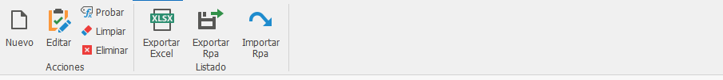

# Variables

1. **Nuevo:** Permite crear una nueva variable.
2. **Eliminar:** Permite eliminar una variable.
3. **Editar:** Permite editar una variable.
4. **Limpiar:** Permite limpiar valores de las variables que hayan sido calculados para iniciar una nueva iteración.
5. **Probar:** Permite probar si una variable se está calculando.
6. **Exportar Excel:** Permite exportar el listado de variables creadas y configuradas.
7. **Exportar Rpa:** Permite exportar variables previamente configuradas para ser implementado en un nuevo flujo de automatización.
8. **Importar Rpa:** Permite importar o agregar variables previamente configuradas a un nuevo flujo de automatización.

## Configuración de Variables

Permite visualizar el listado de variables que por defecto están creadas de las principales funciones que realiza el robot, también permite llevar seguimiento de los parámetros y valores que retorna luego de una iteración.

[Crear una variable](Variables/Crear-una-variable.md)

