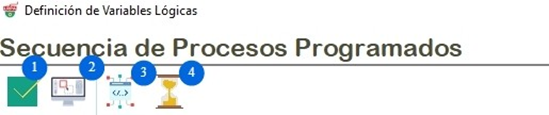

# Crear una variable

1. **Guardar:** Permite guardar la configuración del flujo de trabajo de una variable.
2. **Vista preliminar:** Permite mostrar los parámetros que se almacenan dentro de otras variables.
3. **Compilador:** Permite crear algoritmos para almacenar en una variable.

4. **Test**: Permite validar si determinado parámetro de una variable cumple o no y podrá evidenciar dependiendo del parámetro de la variable si retorna un valor.

# Definición:

1. **Nombre:** Aquí se podrá poner el nombre de la variable, es importante tener en cuenta de que siempre tiene que llevar un signo de dólar (**$**) al principio.
2. **Tipos de variable:** Opción que permite seleccionar el tipo de variables, existen 5 tipos de variables, Fija (**F**), Calculada (**C**), Query (**Q**), Sistema (**S**) y Teclado (**K**).
3. **Descripción:** permite agregar una descripción sobre la función que realiza una variable.
4. **Pegar Valor:** Al marcar la casilla permite que copie un valor y luego lo pegue en el lugar que se le haya asignado.
5. **Seguimiento:** Al marcar la casilla permite escribir el valor que contiene la variable en el reporte del Log .
6. **Servidor:** Al marcar la casilla permite reportar el valor al servidor.
7. **Inicializar:** Al marcarla la casilla permite solicitar que se inicialice el parámetro cada vez que se itere la variable.
8. **Scripter:** permite la ejecución de scripter pascal 
9. **Parámetros**
- *Expresión:* Permite describir las funciones o parámetros que ejecutara la variable automatiza.
- *Condición Si:* Permite describir la condiciones lógicas que determinan si aplica el calculo de las expresiones.
- *Condición No:* Permite describir la condiciones lógicas que determinan si no aplica el calculo de las expresiones.
- *Acciones Previas:* Permite agregar parámetros por medio de variables que se ejecutarán antes de la función de la variable principal.
- *Acciones Posteriores:* Permite agregar parámetros por medio de variables que se ejecutarán después de la función de la variable principal.
- *Valor Actual:* Permite capturar el valor que toma la función de una variable a testearla.
- *Data Out:*
- *Scripter:*
- *On Error:*

# Variables

Permite visualizar el listado de variables que por defecto están creadas de las principales funciones que realiza el robot, también permite llevar seguimiento de los parámetros y valores.

# Variables de sistema

Permite visualizar y buscar cada una de las funciones desplegadas en la sección de Herramientas.

