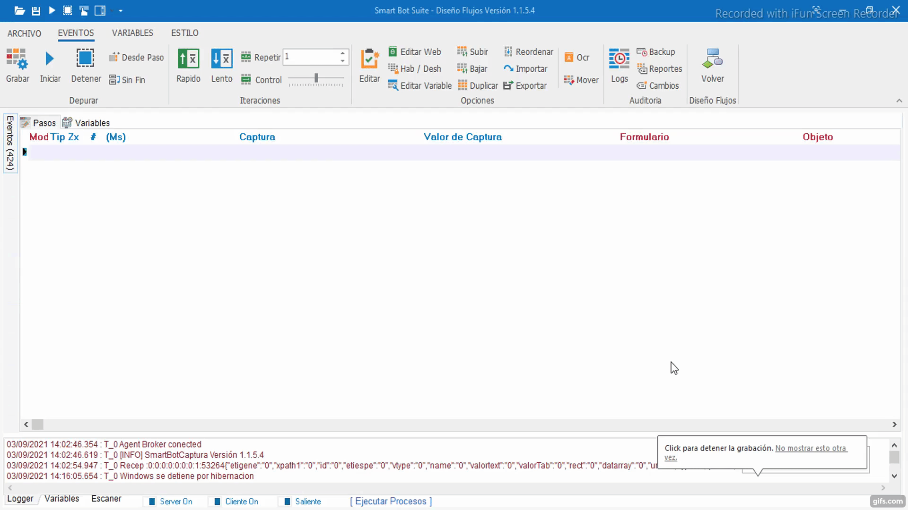
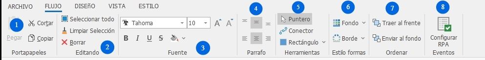
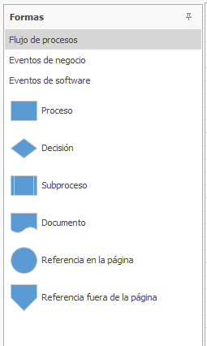
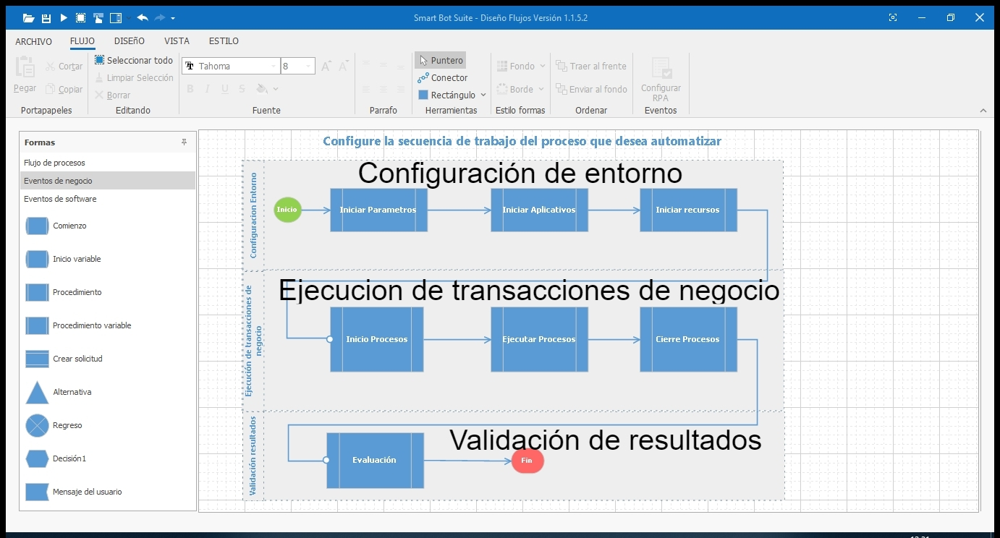
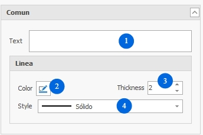
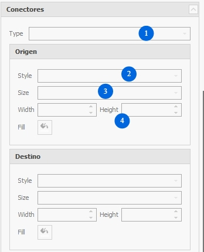
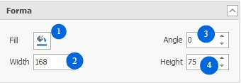

# Flujo

Crea arboles de decisión de procesos dependiendo el tipo proyecto a automatizar, asigne los eventos al proceso según corresponda.

1. **Portapapeles:** Acciones que permiten transferencia de texto y formas del diagrama desde un lugar de origen a uno de destino.
2. **Editando:** acciones que permiten seleccionar todo el diagrama de flujo para su desplazamiento o agregar diferentes estilos, remover la selección completa y borrar el diagrama de flujo.
3. **Fuente:** opciones que permiten la edición de la fuente contenida en el diagrama del flujo.
4. **Párrafo:** opciones que permiten alinear el texto.
5. **Herramientas:** opciones que permiten agregar visibilidad al puntero, conectores entre formas y diferentes formas geométricas para crear el diagrama de flujo.
6. **Estilo formas:** opciones que permiten para agregar color de fondo y borde ****a las formas del flujo.
7. **Ordenar:** opciones que permiten mover de lugar las formas del flujo.
8. **Configurar RPA:** opción que permite acceder a la interfaz donde se parametrizan cada uno de los eventos del flujo.

# Configure diagrama secuencia de automatización

La herramienta le permitirá organizar y dar una secuencia lógica a cada uno de los eventos que desea parametrizar en el flujo.

## Formas

**Subproceso**

Descripción: representa el llamado a un subproceso interno.

**Referencia en la página**

Descripción: Indica que habrá una inspección en este punto.

**Referencia fuera de la página**

Descripción: Indica que hay una referencia cruzada y un enlace de este proceso a otro proceso diseñado en otra página.

**Proceso**

Descripción: representa cualquier tipo de operación

**Documento**

Descripción: Documento o informe impreso

**Decisión**

Descripción: Permite analizar una situación con base en los valores verdadero y falso.

Configuración Entorno

- **Iniciar Parámetros:** permite agregar flujos donde se hayan parametrizado rutas de origen o destino de un aplicativo de escritorio, archivo o directorio.
- **Iniciar Aplicativos:** permite agregar eventos donde se hayan parametrizado uso de aplicativos externos.
- **Iniciar recursos:**

Ejecución de transacciones de negocio

- **Inicio procesos:** permite agregar aquellos eventos que presenten inicio de autenticación, inicio de sesión, etc.
- **Ejecutar procesos:** permite agregar aquellos secuencia de eventos que presenten reglas de trabajo definidas para el proyecto.
- **Cierre procesos:** permite agregar aquellos eventos que se parametrizan para finalizar.

Validación resultados

- **Evaluación:** permitirá agregar aquellos subprocesos que realizarán las validaciones correspondientes según las reglas de negocio del proyecto.

## Propiedades

1. **Texto:** permite agregar nombre a la forma para identificar fácilmente que parte del flujo realiza.
2. **Color:** permite agregar color a las líneas de la forma.
3. **Grosor:** permite definir el grosor de las líneas de la forma.
4. **Estilo:** permite modificar el tipo de líneas de la forma.

1. **Relleno:** permite agregar un color de relleno a la forma.
2. **Ángulo:** modifique el ángulo de posición de la forma.
3. **Ancho**: asigne el ancho de la forma.
4. **Alto**: asigne alto de la forma.

1. **Tipo:** Modifique el tipo de línea de un conector.
2. **Estilo:** Agregue estilo de un conector.
3. **Ancho/alto:** modifique el ancho y alto de un conector.
4. **Llenar:** Agregue color a un conector.