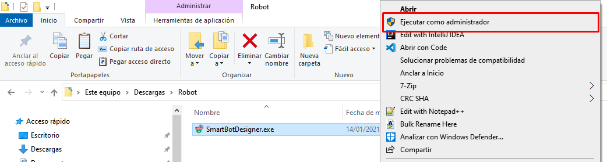

# Instalación

###  Instalación automática

Descargue el complemento [aquí](https://rpamodel.s3.amazonaws.com/UpdaterRpa.zip) y descomprima el contenido, luego ejecute el instalador "UpdaterRpa.exe"

### Instalación manual

Una vez descargado el paquete de instalación, se debe ejecutar con privilegios de Administrador

### Dar clic en el botón aceptar

### Se debe mantener el directorio por defecto del instalador en “C:\” y dar clic en Instalar

### Al terminar el progreso de instalación aparecerá el cuadro de confirmación del complemento Visual C++ 2017, donde se deberá aceptar los términos y dar clic en el botón Instalar

### Si el proceso se realizo correctamente se genera una pantalla de consola indicando que se ha ejecutado con éxito y deberá cerrarla.

