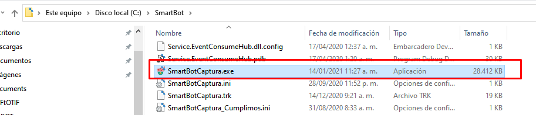

# Primeros pasos

### Al finalizar la instalación deberá dirigirse a la carpeta “C:\SmartBot\” donde encontrará el ejecutable de diseño del robot como se muestra a continuación.

### Una vez abierto el programa se solicitará la cadena de registro del software que será proporcionada por el administrador, al cual deberá facilitar el código de registro del equipo.

### Con el key de registro se confirma la instalación

### Se cerrará y debe volver a iniciar el programa

Entorno intuitivo en el cual se construyen las automatizaciones en el editor tipo “Record y Wizard” presenta una amplia recopilación de variables predefinidas, se integra con distintas fuentes de información y favorece la facilidad de uso, la escalabilidad y la eficiencia.

